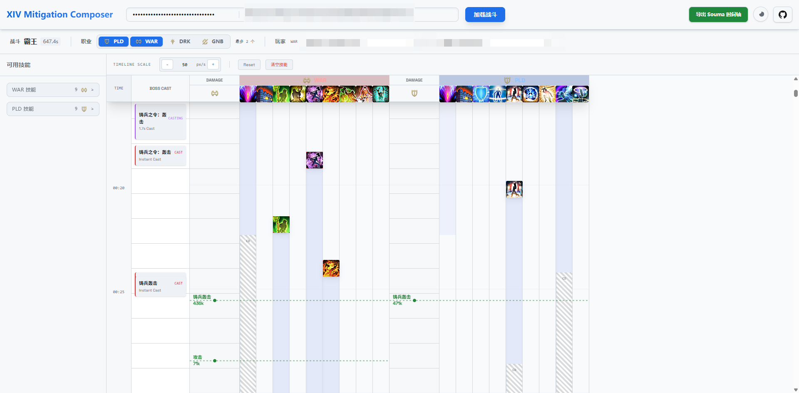

# FFXIV Mitigation Composer (最终幻想14 减伤排轴器)

这是一个用于规划最终幻想14（FFXIV）战斗减伤策略的工具。

## 特性

- **可视化时间轴**：直观地查看和编辑战斗时间轴。
- **拖拽操作**：使用 React dnd-kit 实现流畅的拖拽体验。
- **状态管理**：使用 Zustand 进行高效的状态管理。
- **现代化 UI**：基于 Tailwind CSS 构建的现代化界面。



> [!WARNING]
> **早期开发阶段 (Early Access)**
>
> 本项目目前处于非常早期的开发阶段，功能尚不完善：
> - 仅支持基础的减伤覆盖预览功能；
> - 目前仅支持 4 坦克职业 (PLD, WAR, DRK, GNB) 的个人减伤；
> - 更多功能（如团减、时间轴导入导出等）正在开发中；
> - 可能具有很多影响使用的BUG，并且所有功能均未测试。

## 技术栈

- **前端框架**: [React](https://react.dev/)
- **构建工具**: [Vite](https://vitejs.dev/)
- **语言**: [TypeScript](https://www.typescriptlang.org/)
- **样式**: [Tailwind CSS](https://tailwindcss.com/)
- **状态管理**: [Zustand](https://github.com/pmndrs/zustand)
- **拖拽库**: [@dnd-kit](https://dndkit.com/)

## 使用说明

1.  **加载数据**：
    - 获取 FFLogs 的 `Report Code` (URL 中 `reports/` 后面的一串字符)。
    - 需要一个有效的 FFLogs API Key (V1)。
    - 输入 `Fight ID` (战斗场次 ID)。
    - 点击 **加载战斗**。

2.  **选择角色**：
    - 加载成功后，从下拉菜单中选择你要排轴的 **玩家** 和 **职业**。

3.  **排轴操作**：
    - **添加减伤**：从左侧技能栏将减伤技能拖拽到右侧时间轴上。
    - **调整位置**：在时间轴上左右拖拽减伤条以调整释放时间。
    - **缩放视图**：按住 `Alt` + 滚轮 可缩放时间轴视图。

## 开发

### 1. 安装依赖

```bash
bun install
# 或者以下3选1（未测试）
npm install
yarn
pnpm install
```

### 2. 构建

启动开发服务器：

```bash
bun run dev
```

构建生产环境版本：

```bash
bun run build
```
